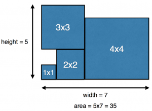
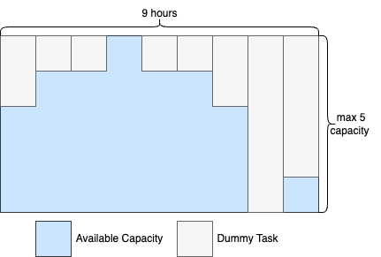

This laboratory will concern basic search modeling in Constraint Programming. First, it will be introduced in the already known `N-Queens` problem. Then, we will solve two new problems, where search modeling will have a big impact on the solving process.

All files required to solve the assignments are available via the repository, so clone it first.

# Search Modeling[](#search-modeling)

So far, we haven't discussed the way the solver looks for the solution. There are many techniques to solve a constraint programming problem. However, basic techniques often perform a DFS (backtracking) search with two steps at every node:

  * select variable — choose, which variable will receive value in this step
  * select value — choose, which value from the variable's domain will be chosen You may control this procedure in MiniZinc using search annotations just after the solve keyword. e.g.

```
    solve :: int_search(array, first_fail, indomain_min, complete) satisfy;
```

mean that integer (`int`) variables from the `array` should be searched exhaustively (`complete`) according to a simple strategy:

  * select variable which has the lowest amount of available values (`first_fail`)
  * select the smallest available value (`indomain_min`).

To define more interesting search strategies, one has to use the so-called MiniSearch language, which still isn't a part of the MiniZincIDE package.

## N-Queens Again[](#n-queens-again)

  * Definition: same as always.
  * Assignments: 
    * Run model using `Gecode (Gist, bundled)` solver — select it in the configuration tab 
      * play with the search :)
    * Check four different search strategies listed below
    * Read about the [different strategies](https://www.minizinc.org/doc-latest/en/lib-stdlib-annotations.html#search-annotations).
    * Choose the best one and put it in the model

```
    int_search(rows, input_order, indomain_min, complete);
    int_search(rows, input_order, indomain_median, complete);
    int_search(rows, first_fail, indomain_min, complete);
    int_search(rows, first_fail, indomain_median, complete);
```

### Extra: Other Annotations[](#extra-other-annotations)

There are many types of annotations in MiniZinc, not all of them concern a search strategy. Occasionally, you would like to specify that a variable is created only for the output purpose and is not used in any constraint, you can use `output_only` annotation (example usage at [the bottom of this doc section](https://www.minizinc.org/doc-latest/en/efficient.html#modelling-choices). The list of such "general" annotation is available [here](https://www.minizinc.org/doc-latest/en/lib-stdlib-annotations.html#general-annotations).

Below you can read about other interesting annotations 😄. You are welcome to experiment!

#### Redundant / Symmetry Breaking constraints[](#redundant--symmetry-breaking-constraints)

You may want to give solver some extra contextual info on your constraints. To achieve that, you can just use special predicates: [`redundant_constraint` and `symmetry_breaking_constraint`](https://www.minizinc.org/doc-latest/en/lib-stdlib-annotations.html#redundant-and-symmetry-breaking-constraints), e.g., `constraint redundant_constraint(x < 3)` means the same as `constraint x < 3`, but gives solver additional info that the constraint is redundant.

#### Restart[](#restart)

Restarting search is a very common strategy in optimization. You can use it in MiniZinc via [restart annotations](https://www.minizinc.org/doc-latest/en/lib-stdlib-annotations.html#restart-annotations). It's a nice trick to find "good" solutions for difficult problems.

#### Gecode Specific Search Annotations:[](#gecode-specific-search-annotations)

The annotations themselves are very closely tied to the chosen solver. Therefore, MiniZinc officially supports only the most generic strategies, but... there is hope for the better future. Gecode is a solver developed by the MiniZinc creator and therefore has received some extra love from the creator and got some additional [search annotations](https://www.minizinc.org/doc-latest/en/lib-gecode-annotations.html) which include "activity"–based search, learning from the previous experience.

Recommended: try `activity` and `afc` annotations with Gecode.

## Packing Problem[](#packing-problem)

The packing problem is a problem of fitting n-dimensional solids in the n-dimensional container. We will discuss a simple case — packing squares into a rectangle.

[](/agh-courses/25/cp/wiki/04/-/wikis/uploads/5976c4ead6e102bff1e41b66a5e31465/square_packing.png)

  * **Definition** : having `n` squares sized accordingly `1x1,2x2,...,nxn`, we have to find the rectangle with the smallest area, inside which we can fit all the squares without overlapping.
  * **Stage 1:**
    * Fill the domains' bounds
    * Tip — use set comprehension (np. `[... |i in SQUARES]`)
  * **Stage 2:**
    * Fill the missing constraints (don't use global constraints, just simple arithmetic), so the model can be solved for small `n`
  * **Stage 3:**
    * Replace your constraint with [the global constraint `diffn`](https://www.minizinc.org/doc-latest/en/lib-globals.html?highlight=diffn#index-109)
    * Tip — you may have to introduce a new array parameter to the model
  * **Stage 4:**
    * Add redundant constraints
    * Tip 1 — how is the packing related to the scheduling, e.g., [the cumulative constraint](https://www.minizinc.org/doc-latest/en/predicates.html#cumulative)?
    * Tip 2 — scheduling is a kind of packing where time is one of the dimensions
    * Tip 3 — [this picture satisfies `cumulative` constraint, but it doesn't satisfy packing constraint](/agh-courses/25/cp/wiki/04/-/wikis/uploads/78236a1c24ba7c4894b1cac67dc84720/cumulative.png)
  * **Stage 5:**
    * Change the search procedure, so the solver would first try the smallest containers
    * Change the search procedure, so the solver would place the biggest squares first.
    * Tip 1 — to force the search order, you have to put the variables in a specific order to the array and then use `input_order` search annotation.
    * Tip 2 — you can put the `height` and `width` in one array (e.g., `[height, width]`), and squares' coordinates in the second (e.g., `[x[n], y[n], x[n-1], y[n-1], ..., x[1], y[1]`). Then use [`seq_search` annotation](https://www.minizinc.org/doc-latest/en/mzn_search.html?highlight=seq_search#index-8) to combine two search procedures
    * Tip 3 — you can achieve a specific order using array comprehensions, but of course, you can also try a built-in function, e.g., [`reverse`](https://www.minizinc.org/doc-latest/en/lib-builtins.html?highlight=reverse) or [`sort_by`](https://www.minizinc.org/doc-latest/en/mzn_search.html?highlight=seq_search).
  * Evaluate the new search procedure with the more difficult instances (bigger `n`))

## Practical Use-Case — Scheduling[](#practical-use-case--scheduling)

Now, you're ready to handle a more practical case based on a real scheduling problem.

The KrakPass factory is producing positive grades for AGH students. Thanks to the large number of employees, it can grade several students at once. Their schedule is an array of non-negative numbers for every hour the factory operates. For example, the following schedule `[3,4,4,5,4,4,3,0,1]` means that the factory is open for `9` hours, during the first hour it can handle `3` students at the same time, during the second hour `4`, …, in the eighth hour `0` and in the ninth `1` student.

During the exam session the positive grades are in demand and therefore students have to book their visits beforehand using an innovative system "Virtual KrakPass". They specify the exact hour their prefer (e.g., 1st hour or the 4th one). Thanks to the complex machine learning algorithms, "Virtual KrakPass" can predict how many minutes it will take to handle each student. In other words, every student has two parameters:

  1. during what hour they want to appear (`1` means they would like to be graded in first `0-59` minutes)
  2. how many minutes it will take to grade them.

Create a MiniZinc model that will plan the students' visits, so their grading wouldn't exceed the factory schedule limits and their visits happened as close as possible to their preferences.

### Some Useful Remarks:[](#some-useful-remarks)

  * student doesn't have to appear on the hour (they may be planned to be tested on 08:17 for example) — you may want to count time using minutes instead of hours;
  * `visits_preferred_hours` are just preferences — student may arrive before/after, it just should be close to the preferred time; the objective should be a sum of _squared_ violations, e.g., if student is scheduled to be graded at `56` and their preference was `2` (2nd hour, so starting from 60th minute), the preference violation equals `4`.
  * if a student wants to be graded in the 2nd hour, the minute the grading should start falls inside time window `[60, 119]` including `60` and `119` but excluding the `120`-th minute
  * consider it to be a packing problem with a _rugged_ container — the best way to make the container irregular is to add _dummy_ students using factory resources, e.g., for data `[3,4,4,5,4,4,3,0,1]` you can visualize it this way:

[](/agh-courses/25/cp/wiki/04/-/wikis/uploads/1eb6a8168df18ff40bb34c4991b5b62a/krakpass.png)

  * finally, use some search annotations to help solver find the solution quickly — make it look first for the solution with the lowest possible violations. 
    * **Tip** : You may want to use `seq_search([annotation, ...])` ([documentation](https://www.minizinc.org/doc-latest/en/lib-stdlib-annotations.html#mzn-ref-stdlib-annotations-search-seq-search)) to combine several search annotations, e.g., 
      * first, make sure students are not scheduled too early;
      * secondly, make sure they are not too late.
    * After adding the search annotations, you should be able to solve the `krakpass_large.dzn` instance using the built-in `gecode` solver.

