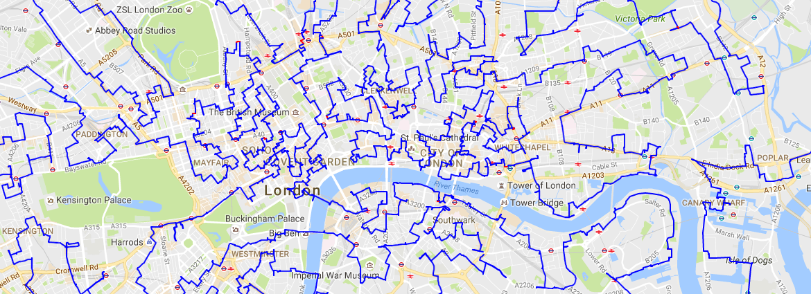

# Beyond CP Solvers[](#beyond-cp-solvers)

  * [Beyond CP Solvers](#beyond-cp-solvers)
    * [1\. Traveling Salesman Problem](#1-traveling-salesman-problem)
    * [2\. Naive Constraint Programming Model](#2-naive-constraint-programming-model)
      * [2.1. Assignment:](#21-assignment)
    * [3\. Flow Network Model](#3-flow-network-model)
      * [3.1. Flow Preservation](#31-flow-preservation)
      * [3.2 Maintaining Cycle Length](#32-maintaining-cycle-length)
      * [3.3. Assignment](#33-assignment)
      * [3.4. Words of Wisdom](#34-words-of-wisdom)
    * [4\. Large Neighborhood Search](#4-large-neighborhood-search)
      * [4.1. Assignment](#41-assignment)
      * [4.2. Words of Wisdom](#42-words-of-wisdom)

Classical Constraint Programming (and SAT) solvers are magnificent achievements of modern computer science. They (reasonably) quickly find solutions satisfying the given constraints, however, when it comes to optimization they still tend to be slower than two other commonly used optimization techniques:

  * [metaheuristic](https://en.wikipedia.org/wiki/Metaheuristic) methods (e.g. Local Search, Genetic Algorithms), that work by iteratively improving the initial solution. Those algorithms often give excellent results, but have two major disadvantages: 
    * there is no standard way to model the problems;
    * they can't prove they found an optimal solution.
  * [integer programming](https://en.wikipedia.org/wiki/Integer_programming) describes problems in terms of mathematical equations. Algorithms belonging to this family are incredibly efficient, but there is no free lunch and they also come with a price: mathematical models typically put some requirements on the constraints, e.g., the constraints have to be linear. The problem is that many real problems are non–linear and it's at least not obvious how to linearize them.

Today we will learn, how one can use those alternative techniques combined with MiniZinc.

## 1\. Traveling Salesman Problem[](#1-traveling-salesman-problem)

We use as the benchmark the [traveling salesman problem (TSP)](https://en.wikipedia.org/wiki/Travelling_salesman_problem) which is a surprisingly hard problem. An example of this problem would be to find the shortest path connecting all the pubs in London. The map below shows part of the solution for this particularly useful query of research:

[](/agh-courses/25/cp/wiki/wiki-06/-/wikis/uploads/567cd7635f4f57538972cb9057d15dca/london_line.png)

In the repository `data` directory you will find several small TSP instances consisting just of a distance matrix (a fully connected graph with all the nodes in the problem where weights are the corresponding distances).

## 2\. Naive Constraint Programming Model[](#2-naive-constraint-programming-model)

The naive model of the `n`–city TSP problem works as follows:

  1. route is represented as `n`–element array `route`, where `route[i]` is the index of the city visited as `i`–th, e.g. `[2,4,3,1]` is a route `2` -> `4` -> `3` -> `1` -> `2`
  2. every city should occur only once in the route
  3. one should statically break symmetry by fixing the starting point
  4. the objective is to minimize the total distance `distance[route[1], route[2]] + distance[route[2], route[3]] + ... + distance[route[n], route[1]]`

### 2.1. Assignment:[](#21-assignment)

  1. Create a naive model in the `tsp_naive.mzn` file.
  2. Try to run it on several data instances using `gecode` solver. does it handle them well?

## 3\. Flow Network Model[](#3-flow-network-model)

The more practical model would be to represent the TSP problem as a [flow network](https://en.wikipedia.org/wiki/Flow_network). It's a bit more complicated but is certainly smarter.

### 3.1. Flow Preservation[](#31-flow-preservation)

So... the flow network is a directed graph over all the cities in the problem, where edges can be either active or inactive. We will represent it with a two–dimensional array of boolean variables `flow`. There are two constraints involved:

  1. every city has to be a source (start) of a single active edge.
  2. every city has to be a sink (end) of a single active edge.

This way every city will be just a transit point in the route... You could now try to put those in the `tsp_flow.mzn` see how it works. The length of the route is just the length of all the active edges... You should notice something strange — instead of a single hamiltonian cycle, we get several. Apparently, our flow graph is preserving the flow, but there is no rule forcing it to make a single cycle 😞

### 3.2 Maintaining Cycle Length[](#32-maintaining-cycle-length)

To fix the problem with the number of cycles, we will force every cycle to have a length equal `n` — effectively making it a hamiltonian cycle. We will add the second two–dimensional array `visit_counter` that for every edge will store info, how many nodes have been visited before reaching this edge, so:

  1. for every edge starting in the first node, we will assign `visit_counter = 0`
  2. for every inactive edge (`flow = false`) the visit counter also should be equal `0`, as we never reach this edge. 
     * 💡 to make this constraint linear you may want to consider using multiplication instead of an `if`, e.g. `visit_counter <= flow * max_visit_counter_value`
  3. "the sum of the visits counters for the incoming edges" into the first node should be the maximal visit counter value (open question: _what is the maximal value?_).
  4. for every _normal_ node (not the first node), "the sum of the visits counters for the outgoing edges" has to be bigger than "the sum of the visits counters for the incoming edges" exactly by `1`
     * 💡 we do this summing to get rid of the inactive edges

### 3.3. Assignment[](#33-assignment)

  1. Create a flow model in the `tsp_flow.mzn` file.
  2. First, run `gecode` again using this model.
  3. Then, try `COIN-BC` — a built-in linear solver and compare the results :)

### 3.4. Words of Wisdom[](#34-words-of-wisdom)

This flow model will work only for small instances (like the ones in the `data`). The number of constraints grows too quickly with the number of nodes and therefore soon stops being practical. Real TSP solvers extend this model with _cuts_ — instead of adding all the constraints at once, they lazily remove some solutions from the search space while solving. MiniZinc doesn't support the lazy constraints, but [this webpage](https://web.archive.org/web/20131216173935/https://iaindunning.com/2013/mip-callback.html) shows how to do it in the JuMP modeling framework. The best TSP solver in the wild is [Concorde](https://en.wikipedia.org/wiki/Concorde_TSP_Solver) and it operates in a similar way.

> 💡 **Did you know?**
> 
> When using global constraint `circuit`, the best MIP solvers will use the _cuts_ automatically.

## 4\. Large Neighborhood Search[](#4-large-neighborhood-search)

There are two ways to use metauheristic methods in MiniZinc. The first one, the more obvious, is to look for a metaheuristc solver and just choose it in the MiniZincIDE (there are at least two: [oscar-cbls](https://bitbucket.org/oscarlib/oscar/wiki/CBLS) and [yuck](https://github.com/informarte/yuck)). We will, however, try a more generic technique called Large Neighborhood Search (LNS).

The idea behind LNS is very simple: you don't have to optimize the whole problem at once — you may optimize just a part of it and when it's done, move to another part. The diagram below presents this approach in a detail:
```
    graph TD;
      A[1. find an<br/>initial solution]-->B[2. mark the solution<br/>as the best];
      subgraph LNS
        B-->C[3. relax the<br/>best solution];
        C-->D[4. optimize the<br/>relaxed solution];
        D-->E{5. is it better<br/>than the current<br/>best solution?};
        E-->|yes|B;
        E-->|no|C;
      end
```

Now we can explain the steps as follows:

  1. find an initial solution — we have to provide LNS with an initial solution; it doesn't have to be great — it just has to be correct.
  2. mark the solution as the best — we just have to remember which solution is our current best candidate.
  3. relax the best solution — here comes the fun part. As I've written above, we want to optimize only a part of the problem. Now we decide which part should be optimized in the next step. We take an existing solution and we _erase_ some variables, e.g. we remove assignments from the 10% randomly chosen variables!
  4. optimize the relaxed solution — we take the relaxed solution as an input to our model. We _fix_ (like in sudoku) all the variables that already have values in the relaxed solution. In other words, our solver has only to find optimal values for the relaxed variables. We **optimize only part of the problem** and get a new solution...
  5. is it better than the current best solution? If that's the case, we move to step 2. Otherwise, we start again from 3.

The scheme is quite basic, but it delivers great results. You should also notice it does work with any solver, not only constraint programming ones.

### 4.1. Assignment[](#41-assignment)

  1. Create a model to find an initial solution in the `tsp_init.mzn` file.
  2. Create a model to improve the solution in the `tsp_improve.mzn` file.
  3. Fill missing code in the `tsp_lns.py` and run it! 
     * This is the first time we do some programming in python, so be aware that you've to install the packages from the `requirements.txt` (including the [`minizinc[dzn]` library](https://minizinc-python.readthedocs.io/en/latest/getting_started.html#installation)) before running this script.

### 4.2. Words of Wisdom[](#42-words-of-wisdom)

The Large Neighborhood is well supported by many [existing solvers](https://choco-solver.org/docs/solving/lns/) and if you've used them directly (without MiniZinc) you wouldn't require external python scripts.

There are many ways to improve the basic LNS:

  1. The relaxation could be smarter, i.e., be problem-specific or [use machine learning](https://arxiv.org/abs/2107.10201)
  2. The relaxation could adapt to the process, i.e., if one can't improve the solution by relaxing just 10% of variables, maybe 15% could help? :) It's called Adaptive Large Neighborhood Search. In fact, the `tsp_lns.py` implements this approach naively.

> 💡 **Did you know?**
> 
>   1. There is a special [search annotation](https://docs.minizinc.dev/en/stable/lib-gecode-annotations.html#relax-and-reconstruct) to use LNS with Gecode
>   2. _OR Tools CP-SAT_ solver is using naive LNS automatically when using [many threads](https://github.com/google/or-tools/blob/stable/ortools/sat/docs/troubleshooting.md#improving-performance-with-multiple-workers) in parallel
>   3. _OR Tools_ has a special routing solver designed to solve TSP and related problems. You cand read about it [here](https://developers.google.com/optimization/routing/tsp?hl=en). The repository contains `tsp_ortools_routing.py` file presenting how to use the solver.
> 

