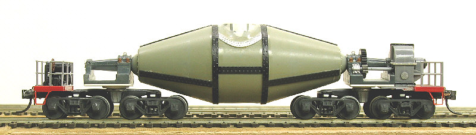
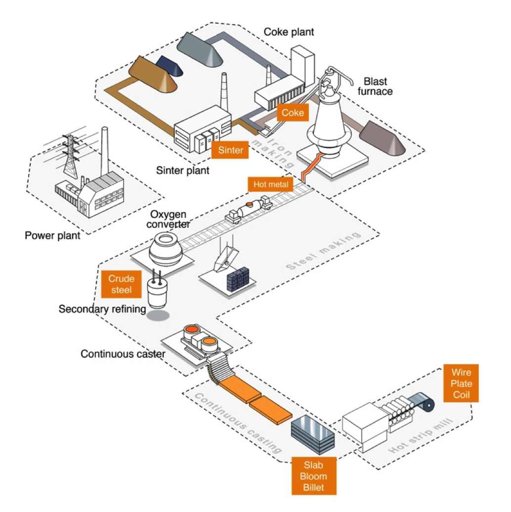
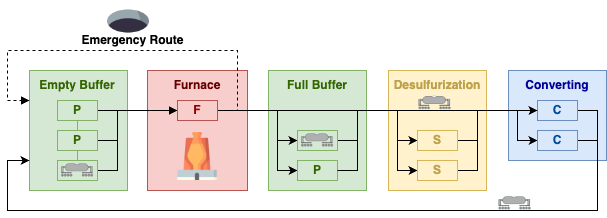

# Project A. Torpedo Scheduling

This project concerns scheduling torpedoes at a steel mill facility..
It is a slightly modified version of a problem used as the ACP 2016 challenge, created by Pierre Schaus, Cyrille Dejemeppe, Sébastien Mouthuy, François-Xavier Mouthuy and Paul Gaborit. 

## :boxing_glove: Competition :boxing_glove:

There are two alternative competitions for this problem:

- [an easier variant](https://gitlab.com/agh-courses/25/cp/project-b-torpedo-scheduling/-/wikis/Scoreboard-Easy) — solve `data/inst_config3_300_200.json` and put the results in `competition_easy.sol`
- [a real challenge](https://gitlab.com/agh-courses/25/cp/project-b-torpedo-scheduling/-/wikis/Scoreboard) — solve `data/competition.json` and put your results in `competition.sol`

A single team can take part in both, but in the end they will receive based only on their best position in any of them.

## Instructions

1. Fork this project into a **private** group:
2. Add @bobot-is-a-bot as the new project's member (role: `maintainer`) 
4. Read this `Readme` to the end!
5. Solve the problem!
6. Automated tests will be run periodically to check the quality of your model. The results will be available in the `GRADE.md`
7. If done before the deadline, contact the teacher via Teams, so he can check it earlier.
8. To take part in the competition, create a `.sol` file containing solution to the dataset as defined in the :boxing_glove: Competition :boxing_glove: section.

## Problem Details

The [icon](images/icon.png) of the project is just clickbait; we won't schedule torpedoes shot by a submarine.
Instead, we are interested in so-called torpedo cars, which are used to transport molten metal at a steel mill facility via a specially designed railway. Below, you can see what such a torpedo looks like:

{width=50%}

Producing steel involves many complex stages, as presented below:

{width=50%}

We will focus only on the stage between the blast furnace and the converter.
The idea is fairly basic:

1. A blast furnace produces a molten metal of various quality — we know its schedule, i.e.,
- When is the metal produced: array `metalStartsPouringAt` in the input data 
- What is its quality (sulfur level): value between `1`—`5` stored in array `metalSulfurLevels`
  
2. An oxygen converter is then used to reduce the amount of carbon and other impurities in the batch. We know:
   - At what time the converters expect a new batch of molten ore: array `converterOpensAt`
   - What is the required minimum quality of the ore (sulfur level) of a given batch: `converterMaxSulfurLevels`

3. If we want to convert an ore of an insufficient quality (high sulfur level), we have to first visit a desulfurization facility to reduce the sulfur level. It is optional; if the quality is fine, we can just pass it to the converter.

4. Sometimes the blast furnace produces more ore than the converter can handle — in such cases, there is an emergency pit where the ore should be discarded.

The diagram below presents the problem:



1. All torpedoes begin their adventure at the **Empty Buffer**. It is a kind of parking lot, and we will assume that it has an infinite number of places.

2. Travel between the **Empty Buffer** and the **Blast Furnace** takes `timeToTransferFromEmptyBufferToFurnace`. 
There can be only one torpedo at the **Blast Furnace** and the `timeToPourMetal` parameter tells how long it takes to pour metal into the torpedo

3. Then the torpedo can travel to the **Full Buffer**, an intermediate parking lot with `numOfSlotsAtFullBuffer` parking places. The travel from the **Blast Furnace** to the **Full Buffer** takes `timeToTransferFromFurnaceToFullBuffer`. The torpedo can stay there to wait, but it doesn't have to.

4. Then the torpedo moves to the **Desulfurization** facilty. The trip takes `timeToTransferFromFullBufferToDesulf` and there are `numOfSlotsAtDesulf` spots at the facility. Again, the torpedo doesn't have to stay there. If the sulfur level has to be reduced — reducing it by `1` takes exactly `timeToDesulfOneLevel`.

5. The next stop is the **Converter** — the trip takes `timeToTransferFromDesulfToConverter` time and there are `numOfSlotsAtConverter` spots at the facility. It takes `timeToConvert` to convert the single batch.

6. Finally, the torpedo has to return the **Empty Buffer** and the trip takes `timeToTransferFromConverterToEmptyBuffer` time.

##### An Alternative Route

3. An alternative route is to use the **Emergency Route**, ditch the ore in a pit, and come back to the **Empty Buffer**. This whole trip takes `timeToEmergencyTransferFromFurnaceToEmptyBuffer` time.

##### Railway Constraints

Every railway segment connecting two facilities can handle only **one** torpedo at a time. 
To make it clear, there are six segments:

- **Empty Buffer** → **Blast Furnace**
- **Blast Furnace** → **Full Buffer**
- **Full Buffer** → **Desulfurization**
- **Desulfurization** → **Converter**
- **Converter** → **Empty Buffer**
- **Blast Furnace** → **Empty Buffer** (emergency route)

### Goal

Our task is to find the best schedule for the torpedoes. There are three ways we can measure the quality of a schedule:

1. The most important thing is that a good schedule will produce as much steel as possible, i.e., the converter will be used as much as possible. There should always be a torpedo waiting when the converter is opened.

2. Secondly, we want to use as few torpedoes as possible. 

3. The last and least important factor is that the desulfurization process is expensive; we would like to minimize the total time spent at the **Desulfurization** facility.

The first objective is the most important, i.e., only if two schedules produce the same amount of steel does the number of torpedoes matter. And, in the same vein, the third objective is considered only after the first and second ones are optimized.

## Input

An example input for a problem is presented below.
There are five metal batches produced by the furnace, and the converter expects four batches. Note that at least one batch will have to be dropped at the emergency pit.

```javascript
{
   "timeToPourMetal": 5,
   "timeToDesulfOneLevel": 5,
   "timeToConvert": 5,
   "numOfSlotsAtFullBuffer": 4,
   "numOfSlotsAtDesulf": 2,
   "numOfSlotsAtConverter": 2,
   "timeToTransferFromEmptyBufferToFurnace": 1,
   "timeToTransferFromFurnaceToFullBuffer": 2,     
   "timeToTransferFromFullBufferToDesulf": 1,
   "timeToTransferFromDesulfToConverter": 2,
   "timeToTransferFromConverterToEmptyBuffer": 4,
   "timeToEmergencyTransferFromFurnaceToEmptyBuffer": 20,
   "metalStartsPouringAt": [ 5, 15, 25, 47, 70 ],
   "metalSulfurLevels": [ 3, 5, 3, 2, 3 ],
   "converterOpensAt": [ 30, 57, 62, 80 ],
   "converterMaxSulfurLevels": [ 2, 1, 1, 3 ]
}
```

## Output

The output consists of information about the transport of each batch and the objective.
For the input given above, the output could be:

```
assignedTorpedo = [1, 2, 3, 1, 2];
assignedConversion = [1, -1, 2, 3, 4];
startTrip = [0, 9, 19, 39, 51];
startFurnace = [1, 10, 20, 40, 52];
endFurnace = [10, 20, 30, 52, 75];
startFullBuffer = [12, -1, 32, 54, 77];
endFullBuffer = [12, -1, 32, 54, 77];
startDesulf = [13, -1, 33, 55, 78];
endDesulf = [18, -1, 43, 60, 78];
startConverter = [20, -1, 45, 62, 80];
endConverter = [35, -1, 62, 67, 85];
endTrip = [39, 40, 66, 71, 89];
numMissedConversions = 0;
numUsedTorpedoes = 3;
totalDesulfTime = 20;
```

The **first** batch was transported by the first torpedo and was finally processed by the first *conversion*. The torpedo left the empty buffer at time `0`, then arrived at the furnace at `1`. After 9 time units, it departed to the full buffer at `10` and passed it without stopping at time `12`. At `13` it visited the desulfurization facility and departed at `18`, decreasing the sulfur level by one. The torpedo arrived at the converter at `20` at departed at `35`, reaching the empty buffer at `39`, effectively ending the trip.

The **second batch** has a different story. It has been taken by the second torpedo and has not been delivered to the converter (value `-1` means a missing value). Then the torpedo started its trip at `9`, arrived at the furnace at `10`, and left it at `20`. Then it took the emergency route (`-1` in the following fields...) and arrived at the empty buffer at `40`.

The last three output fields are related to the objective:

- There have been `0` conversions missed — so the production is at the maximal level
- There have been only `3` torpedoes used
- Torpedoes have spent a total `20` time units at the desulfurization facility
